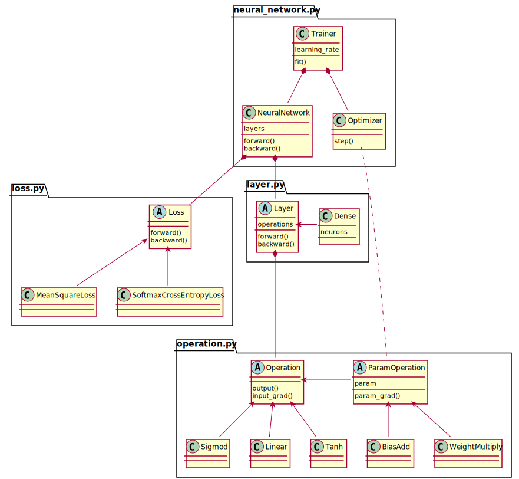

# Lab1 Part1实验报告
刘乔升 19300200019

## 代码基本结构

神经网络的实现结构如上图：
1. Operation是最基本的抽象类，实现两个方法：
   1. `forward(input)->output`给定输入矩阵，得到输出矩阵
   1. `backward(output_grad)->input_grad`给定输出对损失的梯度，得到输入的梯度
   
   `ParamOperation`类带有一个参数，并额外实现一个方法`param_grad(output_grad)->param_grad`给定输出梯度，得到参数梯度。

   几个激活函数`Sigmod`、`Linear`、`Tanh`是`Operation`的子类，带有参数的`BiasAdd`、`WeightMultiply`是`ParamOperation`的子类。

1. `Layer`由一组`Operation`组成，`forward(input)->output`方法向前传递输入，得到输出；`backward(output_grad)->input_grad`方法反向传播梯度。

   `Dense`包装了常用的全连接层，依次由`WeightMultiply`、`BiasAdd`和一个可选的激活函数组成。构造时接受神经元数量`neurons`和激活函数`activation`两个参数，生成符合矩阵大小的随机参数。

1. `Loss`是损失函数类，实现两个方法，`forward(output,target)->loss`求损失值，`backward(loss)->output_grad`求输出值对损失函数的梯度。在两个实验中用到损失函数分别是，平方差均值函数`MeanSquareLoss`和Softmax交叉熵函数`SoftmaxCrossEntropyLoss`。

1. `NeuralNetwork`是一个`Loss`和一组`Layer`的组合，实现方法`train(input,target)`按Layer顺序前向传递input，然后计算损失值，再把损失值反向传递，计算每一层的梯度。

1. `Optimizer`类负责优化网络参数，`step(NeuralNetwork)`方法根据神经网络一次前后传播后的梯度调整参数，在实验中只有梯度下降这个实现。`Trainer`类负责训练网络，包括设定训练轮次、打乱样本、把样本处理成batch、在一定间隔后验证损失值。

## 网络结构/参数对比

### `Tanh`和`Sigmod`
`Tanh`的梯度比`Sigmod`更陡峭，在$sin(x)$的拟合中使用`Tanh`替代`Sigmod`能让损失值快速下降。另外`Sigmod`的值域是$(0,1)$，不能作为拟合$sin(x)$的最后一个操作。

### 中间层神经元个数的选择
大约为输入层神经元个数和输出层神经元个数的几何平均值时最佳。比如手写体分类中，输入为784像素，输出为12个类别，则中间层选择$\sqrt{784*12}\approx 97$个神经元。

## 对反向传播算法的理解
整个神经网络中包含大量的可调整参数，并且很难找到各个参数对损失函数的梯度解析解，因此需要用模拟的方法，让样本点经过神经网络，计算出各个参数对损失函数的贡献，让每个参数朝着让损失函数减小的方向调整，然后多次迭代，关于所有参数的损失函数就会趋近于一个极小值点，这时神经网络就训练完成了。

改变神经元的数量和神经网络的结构相当于改变了参数的数量和参数对损失函数的关系，即改变的神经网络对问题的建模水平。如果神经网络的建模水平低于问题的维度，就类似于用一次函数逼近正弦函数，当模型调整到损失函数最小值时，逼近效果仍然较差。而神经网络的维度过高，会增加计算的复杂度，也可能学习到样本的系统误差，即所谓的“过拟合”。