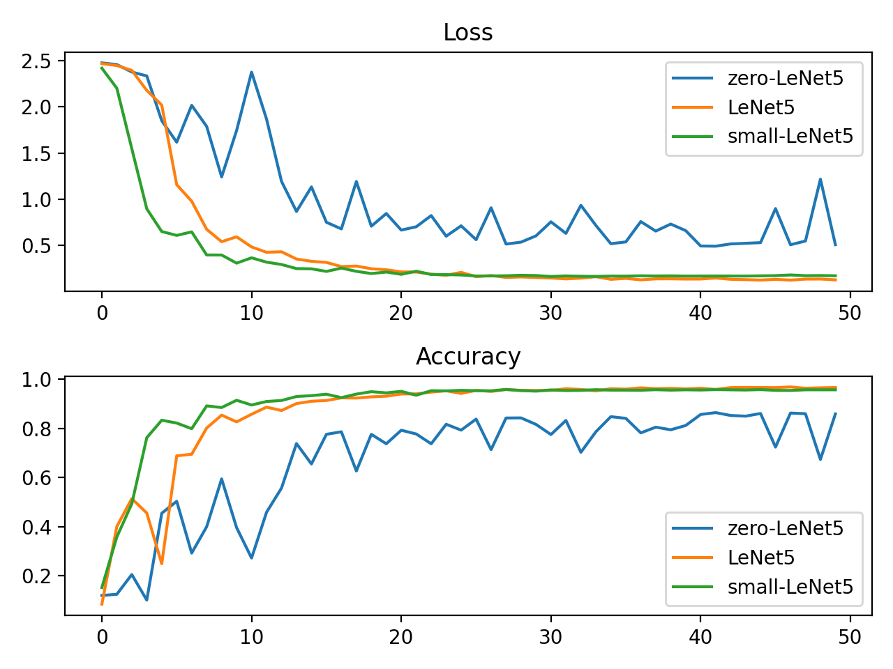
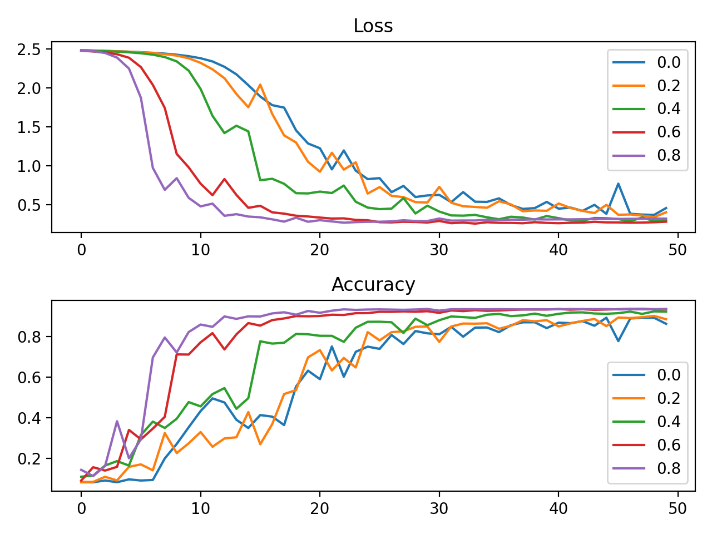
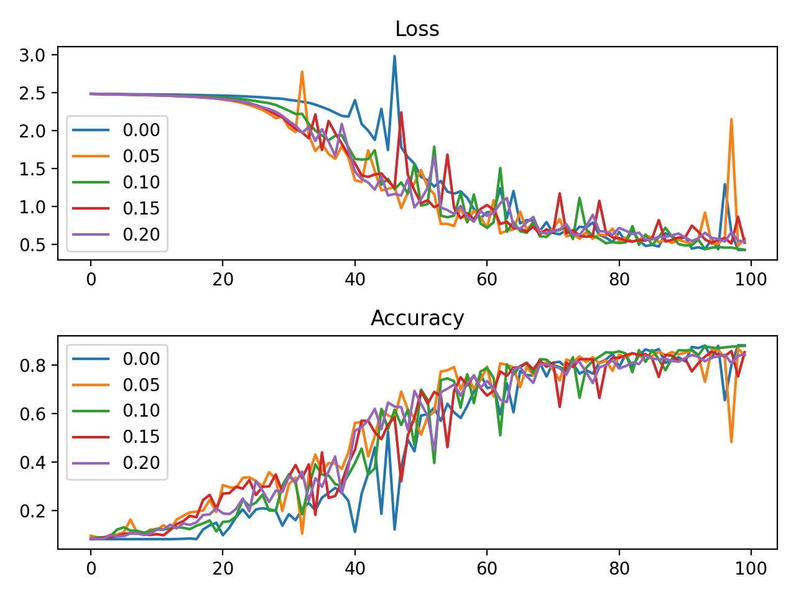

# Lab1Part2实验报告
刘乔升 19300200019

## 网络结构/参数对比

### 使用卷积层数量的对比
基于LeNet5设计了几组对比网络:(1)small-LeNet5，用相同参数数量的全连接层替换一个卷积层；(2)zero-LeNet5，用相同参数数量的全连接层分别替换两个卷积层。

对比在相同训练集和测试集下训练50轮后，网络在测试集上的损失值和正确性，以及网络训练的时间。

使用卷积层的两个网络明显好于不使用卷积层的网络，说明在相同参数数量下，卷积层的学习能力强于全连接层。

在该问题中，small-LeNet5正确率上升得更快，收敛后的预测效果与LeNet5接近，但是训练速度明显慢于后者。

### 使用动量调整参数的学习对比
使用不同动量比例训练相同结构的LeNet5网络，在相同训练集和测试集上比对前50轮学习损失值和正确性的变化。为了突出不同动量比例对消除过拟合的效果，仅选取 **20%** 的数据作为训练集。

不同动量选择得到的收敛值说明动量能减少过拟合。

## Bonus:消除过拟合
1. 使用动量调整参数
   参数调整值中有一定比例来自以前的梯度，减少极端样本对网络的影响。
2. 使用dropout技术
   在一轮训练中随机丢弃一定数量的神经元，相当于舍弃一些特征，防止过度学习样本中的噪声。
   
